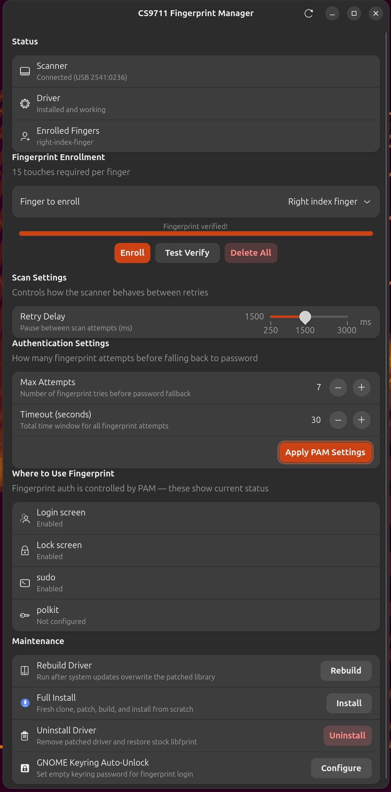

# Chipsailing CS9711 Fingerprint Scanner — Linux Driver Installer

One-command installer for the **Chipsailing CS9711** USB fingerprint scanner on Linux.

Stock `libfprint` does **not** support this chip. This project automates the entire setup: detecting your distro, installing dependencies, cloning the community driver, applying patches, building, installing, and configuring PAM — so your fingerprint works for login, lock screen, and sudo.

## Supported Hardware

| Detail | Value |
|--------|-------|
| **Chip** | Chipsailing CS9711 |
| **USB ID** | `2541:0236` |
| **Form factor** | USB dongle / integrated sensor |
| **Matching algorithm** | sigfm (optimised for small sensors) |
| **Enrollment** | 15 touches per finger |

To check if you have this device:

```bash
lsusb | grep 2541:0236
```

### Important: USB Connection Requirement

If your fingerprint scanner is plugged into a **keyboard's USB passthrough port** (e.g. Royal Kludge RK84, or any keyboard with a USB-A port on it):

- **Wired (USB-C cable):** The scanner **WILL work**. The keyboard's USB passthrough hub is powered and active when connected via cable to the PC.
- **Bluetooth / 2.4GHz wireless:** The scanner **WILL NOT work**. When the keyboard is connected wirelessly, the USB passthrough hub has no data connection to the PC — the scanner gets power but cannot communicate.

**Fix:** Connect your keyboard to the PC with a USB cable. The scanner plugged into the keyboard's USB-A port will then be detected.

This is a hardware limitation of keyboard USB passthrough — it only works when the keyboard itself is wired. This applies to **any** USB device plugged into a keyboard passthrough port, not just fingerprint scanners.

## Supported Distros

| Distro Family | Tested On | Package Manager |
|---------------|-----------|-----------------|
| **Ubuntu / Debian** | Ubuntu 24.04, 26.04, Debian 12+ | apt |
| **Linux Mint / Pop!_OS** | Mint 21+, Pop 22.04+ | apt |
| **Fedora / RHEL** | Fedora 39+, RHEL 9+ | dnf |
| **Arch / Manjaro** | Arch, Manjaro, EndeavourOS | pacman |
| **openSUSE** | Tumbleweed, Leap 15.5+ | zypper |

The installer auto-detects your distro and uses the right package manager.

## Quick Start (All Distros)

```bash
git clone https://github.com/mmhfarooque/chipsailing-cs9711-fingerprint-linux.git
cd chipsailing-cs9711-fingerprint-linux
chmod +x install.sh setup-gui.sh
./install.sh
```

The installer will:

1. Detect your Linux distro and package manager
2. Install all build dependencies
3. Clone the [archeYR/libfprint-CS9711](https://github.com/archeYR/libfprint-CS9711) community driver
4. Apply the **1500ms retry delay patch** (see below)
5. Build and install the patched `libfprint`
6. Configure PAM for fingerprint auth
7. Verify the scanner is detected

Then enroll your fingerprint:

```bash
fprintd-enroll          # 15 touches required
fprintd-verify          # test it
```

## Complete Setup (Driver + GUI)

For the full experience — driver install, enrollment, and graphical manager:

```bash
git clone https://github.com/mmhfarooque/chipsailing-cs9711-fingerprint-linux.git
cd chipsailing-cs9711-fingerprint-linux
chmod +x install.sh setup-gui.sh

# Step 1: Install driver (builds from source, configures PAM)
./install.sh

# Step 2: Enroll your fingerprint (15 touches)
fprintd-enroll
fprintd-verify

# Step 3: Install GUI manager (adds desktop shortcut)
./setup-gui.sh

# Step 4: Launch — or search "CS9711" in your app menu
python3 cs9711-manager.py
```

After setup, you can manage everything from the GUI — enrollment, retry delay, PAM settings, and driver maintenance.

## Install via .deb Package (Ubuntu / Debian / Mint / Pop!_OS)

Pre-built `.deb` packages are available in [Releases](https://github.com/mmhfarooque/chipsailing-cs9711-fingerprint-linux/releases), or build your own:

```bash
# Install build dependencies first
sudo apt install -y git meson ninja-build libfprint-2-dev libglib2.0-dev \
  libgusb-dev libpixman-1-dev libcairo2-dev libssl-dev libopencv-dev \
  doctest-dev gobject-introspection libgirepository1.0-dev fprintd libpam-fprintd

# Build the .deb
chmod +x packaging/deb/build-deb.sh
./packaging/deb/build-deb.sh

# Install it
sudo apt install ./cs9711-fingerprint_1.0.0_amd64.deb
```

Remove: `sudo apt remove cs9711-fingerprint`

## Install via RPM (Fedora / RHEL / openSUSE)

```bash
# Build the RPM
chmod +x packaging/rpm/build-rpm.sh
./packaging/rpm/build-rpm.sh

# Install (Fedora/RHEL)
sudo dnf install ~/rpmbuild/RPMS/x86_64/cs9711-fingerprint-1.0.0-1.*.rpm

# Install (openSUSE)
sudo zypper install ~/rpmbuild/RPMS/x86_64/cs9711-fingerprint-1.0.0-1.*.rpm
```

## Install via PKGBUILD (Arch / Manjaro / EndeavourOS)

```bash
cd packaging/arch
makepkg -si
```

Or use the helper script:

```bash
chmod +x packaging/arch/build-arch.sh
./packaging/arch/build-arch.sh
```

## After System Updates

When your package manager updates `libfprint`, it may overwrite the patched library. Just run:

```bash
./reinstall.sh
```

This rebuilds from the existing local source — no re-download needed.

## The 1500ms Retry Delay Patch

The upstream driver uses a 250ms delay between scan retries. This is too fast — the scanner burns through all retry attempts before you can reposition your finger.

This project patches `CS9711_DEFAULT_RESET_SLEEP` from `250` to `1500` (milliseconds), giving you a comfortable pause between scans.

The patch is in `patches/cs9711-retry-delay-1500ms.patch`.

## PAM Configuration

The installer configures PAM for fingerprint auth:

**Debian/Ubuntu** (`/etc/pam.d/common-auth`):
```
auth sufficient pam_fprintd.so max-tries=7 timeout=30
```

**Fedora/RHEL** (via `authselect`):
```bash
sudo authselect enable-feature with-fingerprint
```

- **max-tries=7** — 7 fingerprint attempts before falling back to password (default is 1)
- **timeout=30** — 30-second window for all attempts (default is 10)

## What It Enables

- Lock screen unlock via fingerprint
- `sudo` authentication (fingerprint prompt before password)
- Login screen fingerprint auth
- All via `libpam-fprintd`

## GUI Manager

A GTK4 graphical manager is included for easy configuration:

```bash
./setup-gui.sh       # Install GUI dependencies + desktop shortcut
python3 cs9711-manager.py   # Launch
```

Or search **"CS9711"** or **"Fingerprint Manager"** in your app launcher after setup.

The GUI lets you:
- View scanner status and enrolled fingers
- Enroll/delete/verify fingerprints with visual progress
- Adjust retry delay (250ms–3000ms slider)
- Set PAM max attempts and timeout
- View which auth locations use fingerprint
- Rebuild/install/uninstall the driver
- Configure GNOME Keyring auto-unlock



## Optional: Auto-Unlock GNOME Keyring

By default, GNOME Keyring requires your password to unlock (fingerprint login skips it). To set an empty keyring password so it auto-unlocks:

```bash
python3 helpers/set-empty-keyring-password.py
```

## File Structure

```
.
├── install.sh                   # Universal installer (auto-detects distro)
├── reinstall.sh                 # Quick rebuild (after system updates)
├── uninstall.sh                 # Remove driver, restore stock libfprint
├── cs9711-manager.py            # GTK4 GUI manager
├── setup-gui.sh                 # GUI dependency installer + desktop shortcut
├── cs9711-manager.desktop       # Desktop entry template
├── patches/
│   └── cs9711-retry-delay-1500ms.patch
├── helpers/
│   └── set-empty-keyring-password.py
├── packaging/
│   ├── deb/
│   │   └── build-deb.sh        # Build .deb package
│   ├── rpm/
│   │   ├── build-rpm.sh        # Build RPM package
│   │   └── cs9711-fingerprint.spec
│   └── arch/
│       ├── build-arch.sh       # Build Arch package
│       └── PKGBUILD
├── VERSION                      # Current version number
├── CHANGELOG.md                 # Version history and release notes
├── LICENSE
└── README.md
```

## Troubleshooting

| Problem | Fix |
|---------|-----|
| `No devices available` | Check USB connection. Run `sudo ldconfig`. Run `lsusb \| grep 2541`. |
| `verify-no-match` | Old enrollment data. Run `fprintd-delete $(whoami) && fprintd-enroll`. |
| System update broke it | Run `./reinstall.sh` or reinstall the .deb/.rpm package. |
| Scanner not detected | If plugged into a keyboard's USB port, the keyboard **must be connected via USB cable** (not Bluetooth/wireless). See USB Connection Requirement above. |
| Burns through retries | Check patch: `grep CS9711_DEFAULT_RESET_SLEEP` in `cs9711.c` should show `1500`. |
| Unsupported distro | Install dependencies manually (see source), then run `install.sh`. |

## Useful Commands

```bash
fprintd-enroll                        # Enroll default finger (right index)
fprintd-enroll -f left-index-finger   # Enroll specific finger
fprintd-list $(whoami)                # List enrolled fingers
fprintd-verify                        # Test fingerprint
fprintd-delete $(whoami)              # Delete all enrolled fingerprints
lsusb | grep 2541                     # Check if scanner is connected
```

## Credits

- **Community driver:** [archeYR/libfprint-CS9711](https://github.com/archeYR/libfprint-CS9711) (maintained fork, originally by [ddlsmurf](https://github.com/ddlsmurf))
- **Retry delay patch & Linux integration:** [mmhfarooque](https://github.com/mmhfarooque)

## Changelog

See [CHANGELOG.md](CHANGELOG.md) for full version history and release notes.

## License

The libfprint driver is licensed under LGPL-2.1 (same as upstream libfprint). The installer scripts in this repo are MIT licensed.
